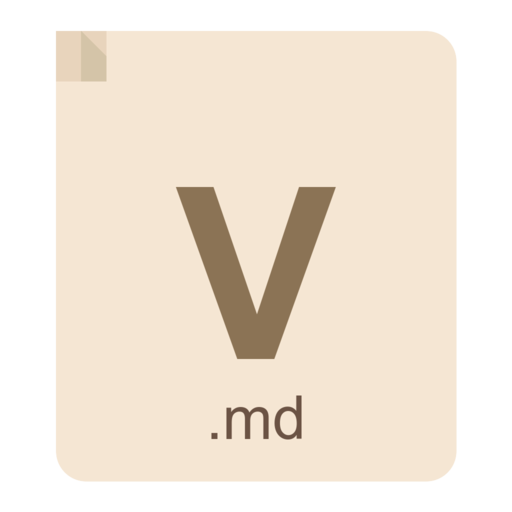

<p align="center">
  
</p>

# Vellum

Fast .md viewer for macOS.

## Installation

### Homebrew (recommended)

```bash
brew install --cask faisalmirza/tap/vellum
```

### Manual

1. Download the latest release from [Releases](https://github.com/faisalmirza/f-md/releases)
2. Unzip and drag `Vellum.app` to Applications
3. Open the app (see below for first launch)

#### First Launch (app is not notarized)

macOS will show a warning because the app is not signed with an Apple Developer certificate. To open it:

**Option A: System Settings**
1. Try to open Vellum.app (it will be blocked)
2. Open **System Settings → Privacy & Security**
3. Scroll down and click **"Open Anyway"** next to the Vellum message
4. Enter your password

**Option B: Terminal**
```bash
xattr -cr /Applications/Vellum.app
```
Then open the app normally.

## Features

- **Live Preview** - See your markdown rendered in real-time
- **Collapsible Editor** - Toggle the editor panel with ⌘E
- **File Browser** - Quickly switch between .md files in the same folder
- **Dark Mode** - Adapts to your system appearance
- **Syntax Highlighting** - Color-coded markdown in the editor
- **Word Count** - Track words and characters
- **Anchor Links** - Click table of contents to jump to sections
- **External Links** - Opens in your default browser
- **Window Persistence** - Remembers size and position

## Requirements

- macOS 13.0 (Ventura) or later

## Keyboard Shortcuts

| Shortcut | Action |
|----------|--------|
| ⌘E | Toggle editor panel |
| ⌘O | Open file |
| ⌘S | Save |
| ⌘W | Close window |

## License

MIT
